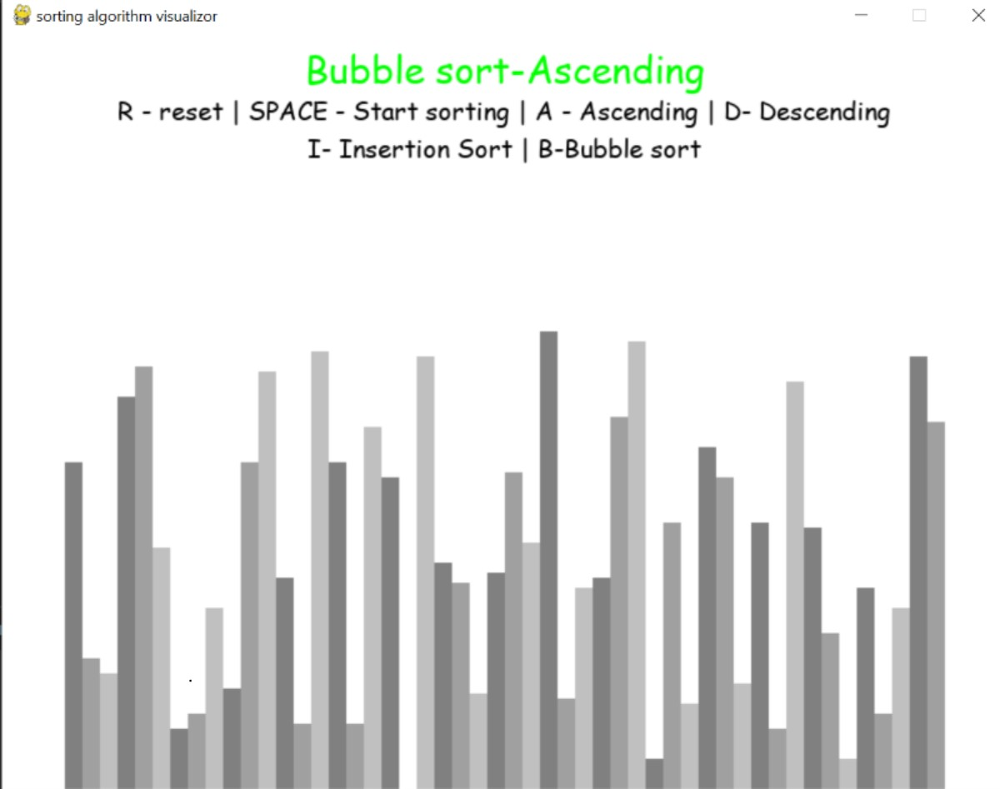

# Sorting Visualizer

This project is a sorting algorithm visualizer built using Python and Pygame. It allows you to see how different sorting algorithms work by animating the process of sorting a list of elements.

## Table of Contents
- [Project Overview](#project-overview)
- [Prerequisites](#prerequisites)
- [Installation](#installation)
- [Features](#features)
- [Usage](#usage)


## Project Overview
The Sorting Visualizer is a tool that helps you visualize the working of sorting algorithms such as Bubble Sort and Insertion Sort. It provides a visual representation of how these algorithms rearrange elements in a list to achieve the desired order.

## Prerequisites
Before you can run the Sorting Visualizer, you need to have the following prerequisites:

- Python 3.x
- Pygame

If you don't have Python installed, you can download it from the official [Python website](https://www.python.org/downloads/).

If you don't have Pygame installed, you can install it using pip:

```shell
pip install pygame

```
## Installation
1. Clone this repository to your local machine:

   ```shell
   git clone https://github.com/yourusername/sorting-visualizer.git
  ```

## Features

The Sorting Visualizer provides the following features:

- Visual representation of sorting algorithms.
- Sorting algorithms available: Bubble Sort and Insertion Sort.
- Real-time animation of the sorting process.
- Ability to reset and start the visualization.
- Ascending and descending sorting options.


## Usage

1. Run the Sorting Visualizer:

   ```shell
   python sorting-visualizer.py
  ```


Use the following controls:

- R: Reset the list.
- Space: Start sorting (available when not sorting).
- A: Toggle between ascending and descending sorting (available when not sorting).
- I: Select the Insertion Sort algorithm (available when not sorting).
- B: Select the Bubble Sort algorithm (available when not sorting).

